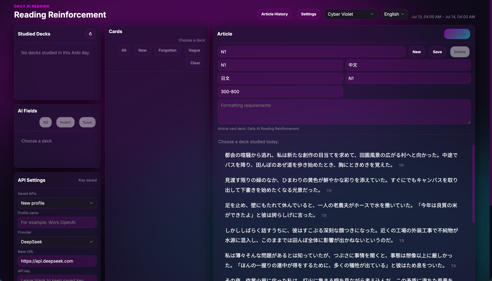
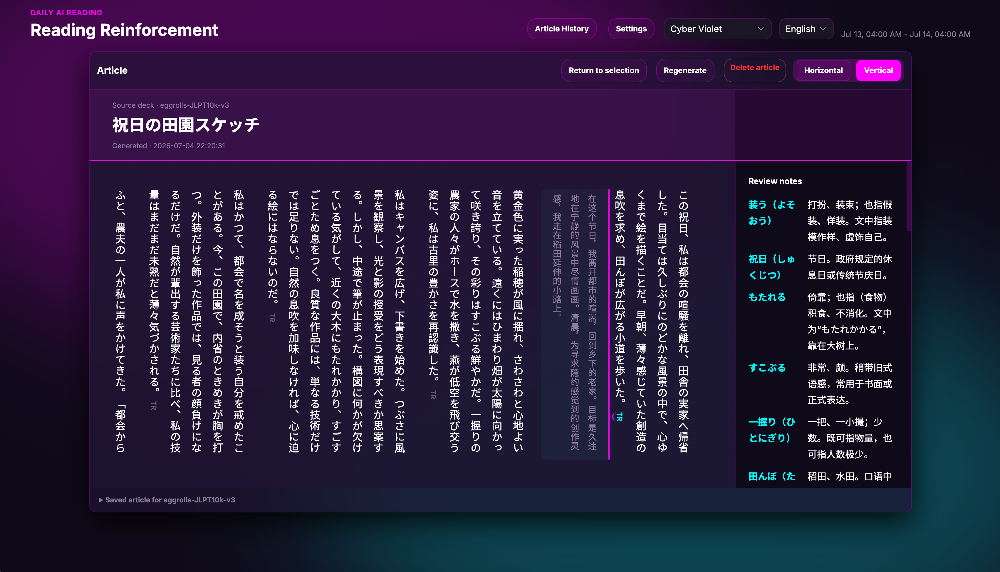

# Daily AI Reading Reinforcement

**Turn today's flashcards into a reading habit.**

[](LICENSE)

Daily AI Reading Reinforcement (DAIRR) turns the vocabulary and cards you studied today into a level-appropriate AI reading article. Use it today as an Anki add-on, or follow the standalone macOS, Windows, and Android work as it develops. The desktop app connects to Anki through AnkiConnect and can also use MoMo as a learning source.

## Preview

The shared interface supports Chinese, English, and Japanese, multiple color themes, reusable generation profiles, article history, and both horizontal and vertical reading.

**[▶ Watch the DAIRR demo video](https://github.com/stors789/Daily-AI-Reading-Reinforcement/releases/download/v1.2.1/DAIRR-demo.mp4)**

### Generation workspace



### Vertical reading



## What it does

- Builds a focused article from the cards you studied or missed today.
- Works with OpenAI-compatible models and configurable prompts, languages, difficulty levels, and article length.
- Provides Chinese, English, and Japanese interface translations plus selectable visual themes.
- Supports horizontal and Japanese-style vertical reading, with translations that can be expanded one paragraph at a time.
- Keeps the original article title, source deck, generated time, source terms, Markdown, and HTML output together.
- Lets you revisit saved articles through a 52-week activity heatmap, filter by deck or day, and reopen an article in read-only mode.
- Can save generated articles as suspended Anki reading cards. Card titles include the precise generation time and the AI-generated article title, so multiple articles from the same day stay distinct.
- Supports multiple saved OpenAI-compatible API profiles and model discovery where the provider exposes a model endpoint.
- Supports Anki-native use today, plus standalone desktop providers for AnkiConnect and MoMo.

## Product surfaces

| Surface | Status | Use it when |
| --- | --- | --- |
| Anki add-on | Supported | You want DAIRR inside Anki and its native collection workflow. |
| Standalone desktop | In active development | You want a native macOS/Windows window with AnkiConnect or MoMo. |
| Android shell | Foundation only | You are developing the Android bridge and provider adapters; it is not ready for end users yet. |
| Browser launcher | Development fallback | You are testing the standalone backend without a native shell. |

The desktop shell is built with Tauri and packages the existing Python backend as a sidecar. Its release pipeline prepares signed macOS and Windows update bundles; publishing the first public update still requires Apple, Windows, and Tauri signing credentials. See [desktop auto updates](docs/desktop_auto_updates.md).

The Android project currently packages the shared web interface and defines a secure bridge boundary, but it does not yet connect to AnkiDroid, MoMo, or an LLM provider. See the [Android shell README](apps/android/README.md).

## Install the Anki add-on

Install from AnkiWeb:

1. In Anki, open **Tools → Add-ons → Get Add-ons…**.
2. Enter **`842038474`**.
3. Restart Anki.
4. Open the add-on configuration and set an OpenAI-compatible API key, base URL, and model.

## Run the standalone app for development

### Browser fallback

```bash
python3 desktop_app.py --provider mock
python3 desktop_app.py --provider ankiconnect
python3 desktop_app.py --provider ankiconnect --check
```

### Native Tauri shell

Requirements: Python 3.11+, Node.js, Rust, and the native dependencies required by Tauri for your platform.

```bash
cd apps/desktop
npm install
npm run dev
```

Choose a provider before launch when needed:

```bash
DAIRR_DESKTOP_PROVIDER=ankiconnect npm run dev
DAIRR_DESKTOP_PROVIDER=real_momo MOMO_TOKEN=your-token npm run dev
```

Read [Desktop Standalone Mode](docs/desktop_standalone.md) for provider behavior, diagnostics, environment variables, and known limits. The architectural boundary is documented in [Tauri App Shell](docs/architecture/tauri_app_shell.md).

### Android shell validation

The Android shell requires JDK 17 and Android SDK 35 to build. Its current fail-closed bridge scaffold can be checked without producing an APK:

```bash
python3 apps/android/tests/validate_scaffold.py
```

## Configure AI generation

DAIRR uses an OpenAI-compatible chat-completions API. Configure the API key, base URL, model, and prompt presets from the add-on or desktop settings. Prompt presets can control:

- the learner's native language;
- the article language and difficulty;
- article length and additional instructions; and
- which card fields are sent as context.

See [the add-on configuration reference](addon/daily_ai_reading_reinforcement/config.md) for the available configuration values.

## Development and packaging

```bash
# Build the Anki add-on
python3 package_addon.py

# Package the legacy browser-style desktop launcher
python3 package_desktop.py --entry browser --windowed --clean

# Package the pywebview transition shell
python3 package_desktop.py --entry native --windowed --clean

# Build the Tauri sidecar for the current platform
python3 package_tauri_sidecar.py --clean

# Validate the Android shell bridge and asset wiring
python3 apps/android/tests/validate_scaffold.py
```

The repository keeps the learning and rendering logic in `packages/dairr_core/`; Anki-specific APIs are isolated in the add-on wrapper. Tests live in `tests/`.

## License and contributions

DAIRR is free and open-source software licensed under the [GNU Affero General Public License v3.0 or later](LICENSE).

Issues and pull requests are welcome. When reporting a provider problem, please remove API keys and tokens from logs before sharing them.
