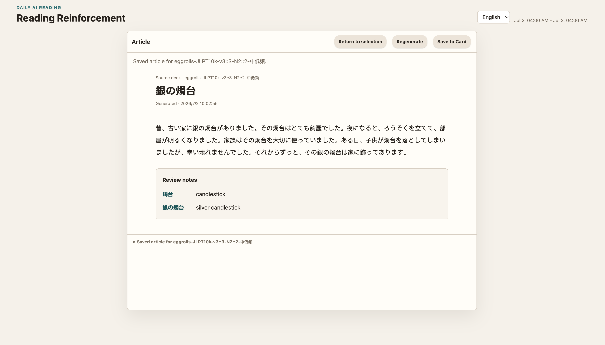
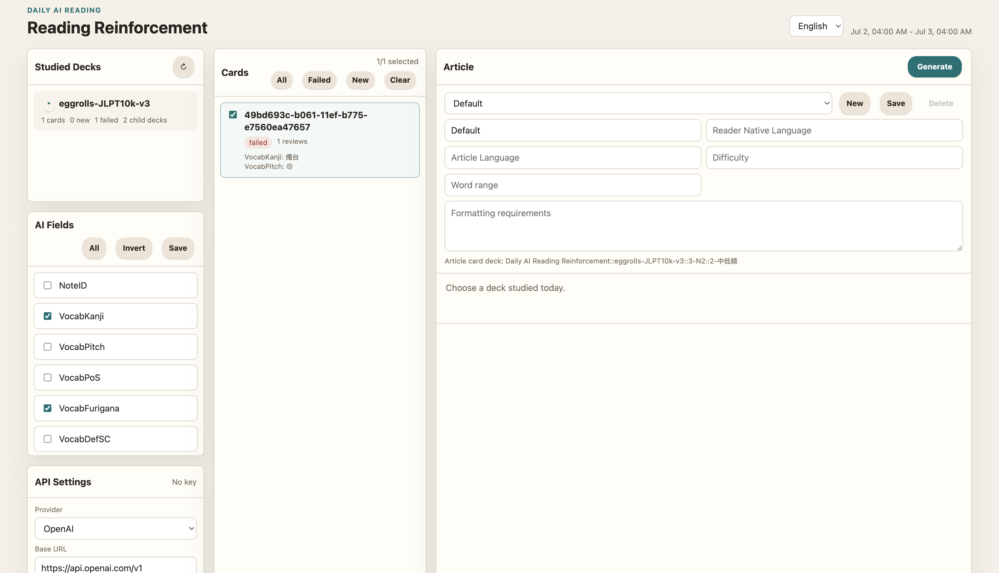

# Daily AI Reading Reinforcement

An Anki add-on that generates a short reading passage from the cards you studied today.

## Introduction

Daily AI Reading Reinforcement is an Anki add-on designed to bridge the gap between rote memorization and practical language application. It automatically extracts the vocabulary or flashcards you've studied today and leverages AI (like OpenAI, DeepSeek, etc.) to generate a short, engaging reading passage incorporating those exact terms.





By reading a coherent story or article constructed from your daily study material, you naturally reinforce your memory through context, shifting from isolated flashcard drilling to active reading comprehension.

## Key Benefits

- **Contextual Reinforcement**: Move beyond isolated rote learning. Seeing your newly learned vocabulary in a natural context dramatically improves retention and deeper understanding.
- **Tailored to Your Progress**: The add-on strictly follows your Anki study history. It generates reading materials based only on the cards you learned or failed *today*, ensuring the content is perfectly aligned with your immediate learning curve.
- **Fully Customizable**: Support for custom prompt presets allows you to dictate the language, difficulty level, and specific formatting requirements for the generated articles.
- **Closed-Loop Learning**: You can seamlessly save the AI-generated articles back into Anki as new reading cards. By default, these reading cards are suspended, allowing you to manually review them whenever you want to test your reading comprehension.
- **Flexible AI Integration**: Works with any OpenAI-compatible API provider, giving you the freedom to choose your preferred AI model.

## Installation

The easiest way to install this add-on is through AnkiWeb.

1. Open Anki and go to **Tools** > **Add-ons** (or **Anki** > **Add-ons** on Mac).
2. Click **Get Add-ons...**
3. Enter the code: **`842038474`**
4. Click **OK** and wait for the download to finish.
5. Restart Anki to complete the installation.

## Layout

```text
addon/daily_ai_reading_reinforcement/
  __init__.py
  core/           # Pure, reusable business logic and Adapter interfaces
  web/            # Cross-platform HTML/CSS/JS UI
desktop_mock/     # Standalone HTTP server & external API providers (e.g., MoMo)
tests/            # Unit tests
```

## Install for Development

Copy or symlink `addon/daily_ai_reading_reinforcement` into your Anki add-ons directory, then restart Anki.

On macOS, the target is usually:

```text
~/Library/Application Support/Anki2/addons21/daily_ai_reading_reinforcement
```

Then open Anki, find the add-on config, and set your API key.

## Desktop Standalone Development

We are currently evolving DAIRR into a standalone cross-platform desktop application. You can run the development desktop server which supports real LLM generation and connects to external APIs like MoMo:

```bash
# Run with Mock MoMo data
python3 desktop_mock/main.py

# Run with Real MoMo API (requires valid MOMO_TOKEN in desktop_mock/mock_data.py or env)
DAIRR_DESKTOP_PROVIDER=real_momo python3 desktop_mock/main.py

# Run with local Anki through AnkiConnect
DAIRR_DESKTOP_PROVIDER=ankiconnect python3 desktop_mock/main.py

# Optional: override the default AnkiConnect endpoint
DAIRR_ANKICONNECT_URL=http://127.0.0.1:8765 DAIRR_DESKTOP_PROVIDER=ankiconnect python3 desktop_mock/main.py
```
Open your browser at `http://127.0.0.1:8755` to use the standalone UI.

There is also a dependency-free desktop launcher. It starts the same local
server and opens the system browser automatically:

```bash
python3 desktop_app.py --provider mock
python3 desktop_app.py --provider ankiconnect
python3 desktop_app.py --provider ankiconnect --ankiconnect-url http://127.0.0.1:8765
```

This is a conservative standard-library launcher for Phase 29. A later desktop
packaging shell can replace it with PyQt6, pywebview, or another native wrapper
without changing the shared web UI or provider logic.

## Config

The add-on uses an OpenAI-compatible chat completions API:

```json
{
  "api_key": "",
  "base_url": "https://api.openai.com/v1",
  "model": "gpt-4.1-mini",
  "selected_provider_profile": "openai",
  "temperature": 0.7,
  "max_tokens": 30000,
  "prompt_template": "",
  "deck_field_config": {},
  "create_article_cards": false,
  "last_selected_deck_id": "",
  "collapsed_deck_groups": [],
  "ui_language": "zh",
  "prompt_presets": [
    {
      "id": "default",
      "name": "Default",
      "reader_native_language": "",
      "article_language": "",
      "difficulty": "",
      "max_words": "",
      "instructions": "",
      "prompt_template": ""
    }
  ],
  "selected_prompt_preset_id": "default"
}
```

If `prompt_template` is empty, the add-on uses a built-in prompt.

## Package

Run:

```bash
python3 package_addon.py
```

The package will be written to `dist/daily_ai_reading_reinforcement.ankiaddon`.
